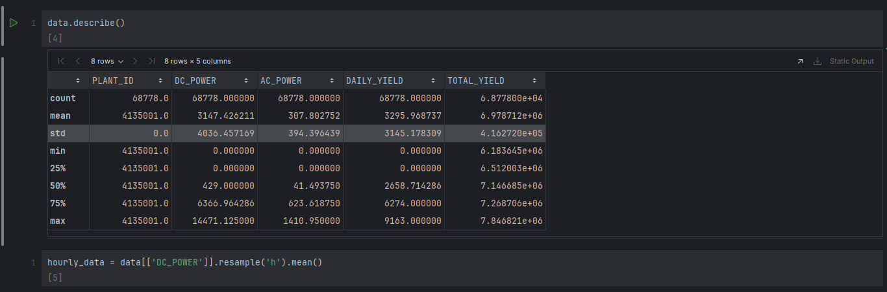
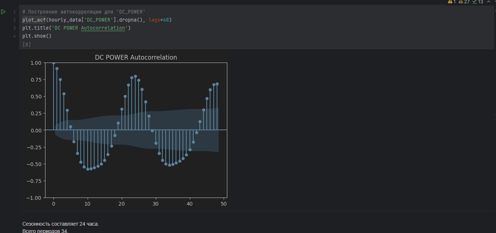

Holt-Winters Forecasting Model with Hyperparameter Tuning

**Цель работы**

Реализация модели прогнозирования временных рядов Хольта-Уинтерса, а также настройка гиперпараметров модели с помощью методов машинного обучения.

**Постановка задачи**

Реализовать модель Хольта-Уинтерса для прогнозирования временных рядов с сезонностью.
Разработать метод для тюнинга параметров сглаживания (alpha, beta, gamma) и, при необходимости, длины сезона.
Провести прогноз на один или более периодов.
Использовать методы машинного обучения для оптимизации гиперпараметров модели.

**Краткое описание модели**

Модель Хольта-Уинтерса предназначена для прогнозирования временных рядов, которые демонстрируют тренд и сезонность.

Используемый набор данных

В работе использовались данные о генерации солнечной энергии на электростанциях в Индии. Сезонность: 24 часа, количество периодов: 34. Данные взяты с Kaggle.

**Функциональность программы**

* Обычный режим:
Принимает временной ряд, параметры сглаживания (alpha, beta, gamma), длину сезона, горизонт прогнозирования.
Возвращает параметры модели и прогнозные значения.

* Режим тюнинга:
Оптимизирует параметры сглаживания и длину сезона.
Выводит оптимизированные параметры модели, прогноз и ошибки (RMSE).

**Результаты**

Реализована базовая модель Хольта-Уинтерса и её оптимизированная версия.
Проведен прогноз генерации энергии на 48 часов.
Показано, что тюнинг гиперпараметров значительно улучшает качество прогноза.

**Скриншоты**

